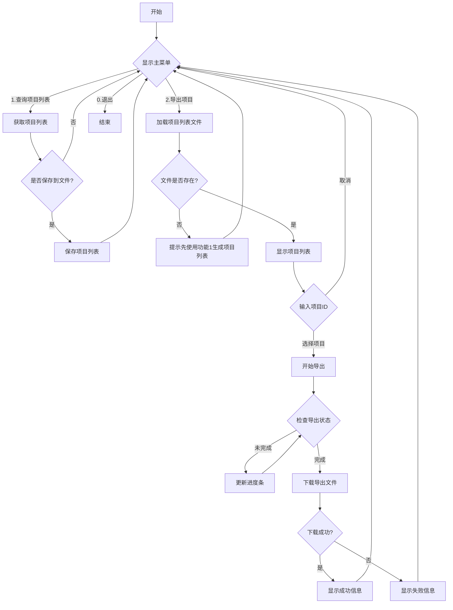

# GitLab 项目导出工具

这是一个用于导出 GitLab 项目的工具，支持查询项目列表和导出项目功能。

## 功能特点

1. 查询项目列表
   - 显示项目ID、名称、命名空间和最后活动时间
   - 支持将项目列表保存到本地文件

2. 导出项目
   - 从本地项目列表中选择要导出的项目
   - 自动处理导出和下载流程
   - 支持重试机制
   - 导出文件命名格式：`<项目ID>_<项目名称>.tar.gz`

## 配置说明

配置文件 `config.yaml` 包含以下设置：
- GitLab 服务器地址
- 访问令牌
- 输出目录
- 下载重试参数

## 程序流程图



## config.yaml 配置说明

配置文件采用 YAML 格式，包含以下主要配置项：

### GitLab 配置
```yaml
gitlab:
  url: "http://192.168.8.124:8929"  # GitLab 服务器地址
  private_token: "your_token_here"   # GitLab 个人访问令牌
```

- `url`: GitLab 服务器的地址，支持 HTTP 或 HTTPS
- `private_token`: GitLab 个人访问令牌，用于 API 认证
  - 获取方式：登录 GitLab -> 用户设置 -> 访问令牌 -> 创建新令牌
  - 需要 `api` 和 `read_api` 权限

### 输出配置
```yaml
output:
  dir: "output"  # 导出文件保存目录
```

- `dir`: 项目导出文件的保存目录，支持相对路径和绝对路径

### 下载配置
```yaml
download:
  max_retries: 3    # 最大重试次数
  retry_delay: 10   # 重试间隔时间（秒）
```

- `max_retries`: 下载失败时的最大重试次数
- `retry_delay`: 每次重试之间的等待时间（秒）

### 配置示例
完整的配置文件示例：
```yaml
gitlab:
  url: "http://192.168.8.124:8929"
  private_token: "SocCSFdQi7EpaCk7nFR3"
output:
  dir: "output"
download:
  max_retries: 3
  retry_delay: 10
```

## 使用说明
### UV
推荐使用[uv](https://docs.astral.sh/uv/getting-started/installation/)直接运行
```
uv run main.py
```

### python
1. 安装依赖：
```bash
pip install requests pyyaml tqdm
```

2. 配置 `config.yaml` 文件
```bash
cp config.yaml.example config.yaml
```
3. 运行程序：
```bash
python main.py
 ```

## 文件结构

```
.
├── main.py              # 主程序
├── ui.py               # 用户界面相关代码
├── gitlab_api.py       # GitLab API 接口封装
├── file_operations.py  # 文件操作相关功能
├── config.py           # 配置处理模块
├── utils.py            # 工具函数
├── config.yaml         # 配置文件
├── config.yaml.example # 配置文件示例
├── pyproject.toml      # Python 项目配置文件
├── .python-version     # Python 版本指定文件
├── .gitignore          # Git 忽略文件配置
├── LICENSE             # MIT 许可证
├── projects/           # 项目列表保存目录
├── output/             # 项目导出文件保存目录
└── .venv/              # Python 虚拟环境目录
```

## 许可证

本项目采用 [MIT 许可证](LICENSE) 发布。
